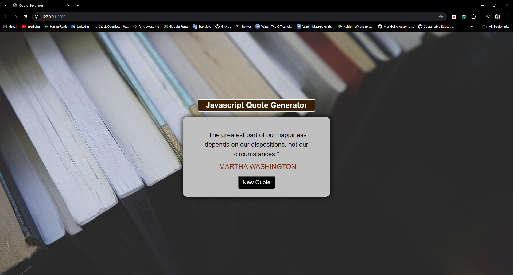

# JavaScript Quote Generator

## Overview

This is a simple JavaScript Quote Generator that fetches random quotes from the Quotable API. The project demonstrates the use of HTML, CSS, and JavaScript to create a dynamic and interactive web application.

## Features

- Fetches a new random quote with the author's name every time the button is clicked.
- Ensures that the same quote is not displayed consecutively.
- Responsive design, ensuring a good user experience on both desktop and mobile devices.

## Usage

1. Open the project in your browser.
2. Click the "New Quote" button to fetch a new random quote.
3. The quote and the author's name will be displayed in the quote area.

## Code Structure

- `index.html`: The main HTML file containing the structure of the web page.
- `styles.css`: The CSS file for styling the web page.
- `app.js`: The JavaScript file containing the logic to fetch and display quotes.

## Acknowledgements

- [Quotable API](https://github.com/lukePeavey/quotable) for providing the quotes.
- [Font Awesome](https://fontawesome.com/) for the icon library.
- [Google Fonts](https://fonts.google.com/) for the font used in the project.
